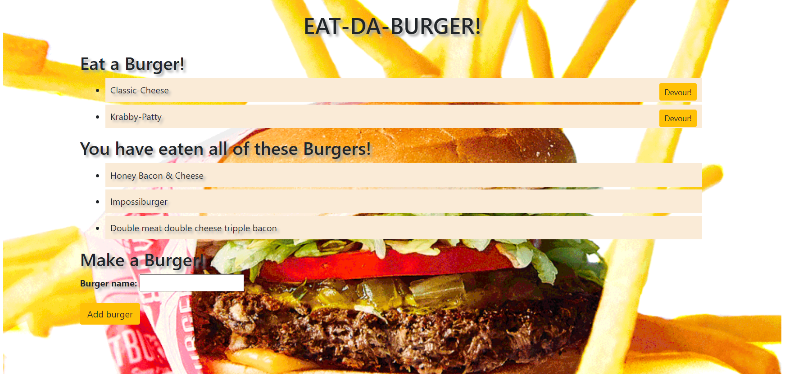

# burger

Click here to view the Deployed [website](https://safe-ravine-30053.herokuapp.com/)

  

  ## Description 

  I built this app to improve upon my sql knowledge as well as learn how handlebar works. The app itself is very simple, when the user opens the link they are presented with the following screen.

  

  Once the create a burger field is filled out, the user is presented with the burger that they named and a button to eat it. If the devour button is selected, the burger is then moved into the eaten section. 

  ## Table of Contents 
  
  * [instalation](#instalation)
  * [License](#license)
  * [Contributing](#contributing)
  * [Questions](#questions)
  
  ## Installation 
  
  To install necessary dependancies, run the following command: 
  ```
  npm i
  ```
  
  ## License
  
  This project is licensed under the MIT license 
  
  ## Contributing
  
  Please pull from the master branch and make pull requests before you attempt to contribute to this repo.

 ## Questions
  
 If you have any questions anout the repo, open an issue or contact me directly at [solemansay](https://github.com/solemansay/). 
 Or send me an email at solemansay@gmail.com

 ```
Thank you for viewing my burger shop project! I hoped you enjoyed my solution and continue to follow my career as a jr full-stack web developer. 
-Soleman Sayeed
```
